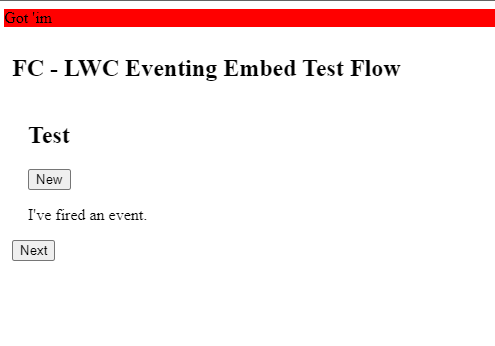

# Lightning Out Replacement

With the new Winter '23 release, Salesforce is finally allowing customers to embed Experience Cloud sites into other sites securely by enabling [relaxed Clickjack Protection for trusted domains](https://help.salesforce.com/s/articleView?id=release-notes.rn_experiences_clickjack_trusted_domains.htm&type=5&release=240). When this capability is combined with Experience Cloud sites built on the [Lightning Web Runtime](https://developer.salesforce.com/docs/atlas.en-us.exp_cloud_lwr.meta/exp_cloud_lwr/intro.htm), customers now have a valid and substantially more performant way to embed Salesforce components and Flows into external sites than [Lightning Out](https://developer.salesforce.com/docs/component-library/documentation/en/lwc/lightning_out). 

Importantly, because of LWR sites' ability to [drop theSLDS framework entirely](https://developer.salesforce.com/docs/atlas.en-us.exp_cloud_lwr.meta/exp_cloud_lwr/brand_remove.htm), this approach also offers designers and web developers far more control of the visual fidelity of the embedding experience than Lightning expeirences traditionally allowed, as well; this makes it easier to achieve pixel perfection. The ability to use [pure JavaScript in LWC](https://developer.salesforce.com/docs/component-library/documentation/en/lwc/js_intro) also allows you to send messages up and down the DOM between the LWC context and the parent iFrame context.

## Sample Code Contents

In the repo, you'll find two assets:

* A simple Lightning Web Component
* A sample HTML page representing the website or web app into which the LWR-based site is embedded.

In this simple scenario, a seperate web application is embedding an LWR-based site with an LWC that is communicating from the site up through the DOM to the encapsulating web app.

## Reqs

1. Salesforce scratch org or dev sandbox
2. Comfort with SFDX
3. Some static asset hosting platform for the sample embedding page (e.g., Amazon S3)

## Setup

1. In the Salesforce scratch org or sandbox, set up Digital Experiences
2. Create a new digital experience site based on the Build Your Own LWR template
3. Create a new SFDX project on your local
4. Move the source for the embeddedLWC into your project
5. Push your project to your org
6. Create a Screen Flow with a single step
7. Drop the LWC into the Flow screen
8. Activate the Flow
9. In Experience Builder, drop the Flow component into the page and select the flow
10. Publish the site
11. Change the iFrameTester.html to update the iframe with your site link
12. Upload the html to S3
13. Visit the S3 url

## Preview

## Bugs and Issues

Have a bug or an issue with this template? Open an issue against the repo and I'll fix it.

## Creator

No warranties, only for example, created with love, etc.